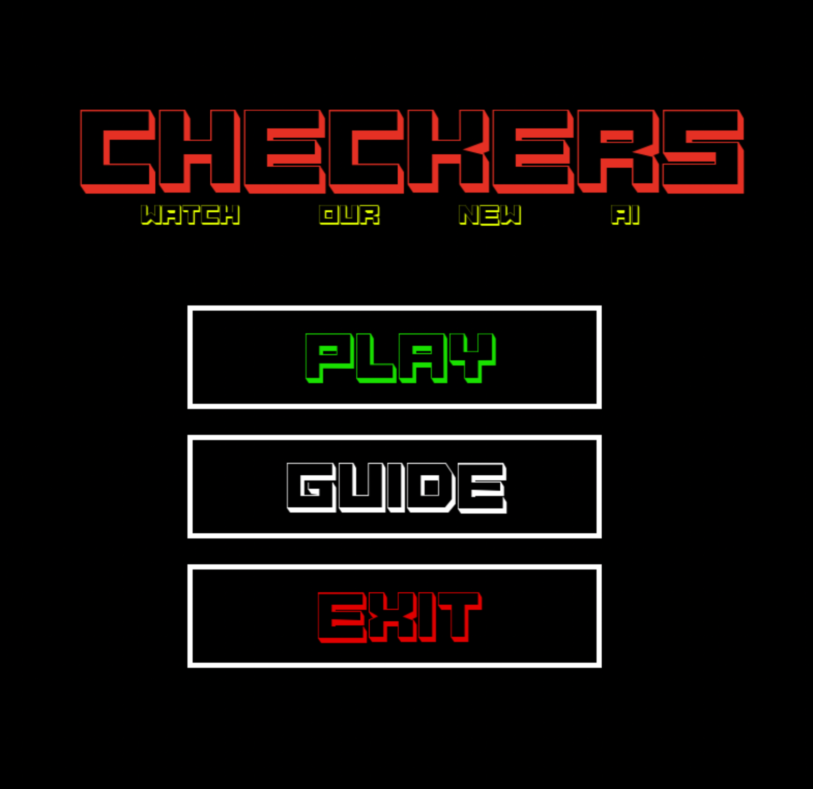
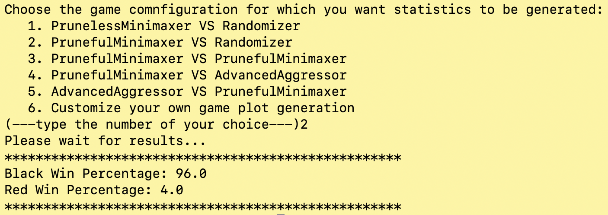
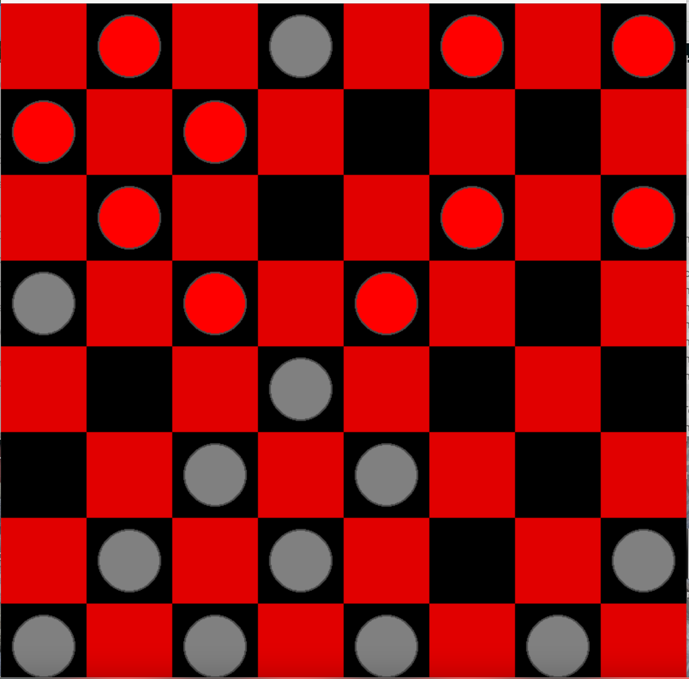

# Check Your Move!

Am implementation of the recursive MiniMax search tree algorithm (in `Python`) for the purpose of
developing an intelligent Checkers Player.



Inspection of the algorithm's performance (against players making random moves as well as
other strategic move-making algorithms) can happen in two ways:
1. Through a UI built with `pygame`, showing live decision making of the algorithm.
2. Through the command-line, where the user puts requested information as prompted.



For detailed instructions and documentation, see `details_docs.pdf`. For a quickstart,
see below.

## Quickstart

To install <Project Name>, follow these steps:

[//]: # (1. **Fork the Repository** &#40;Optional, if you plan to make changes&#41;)

[//]: # (   - Click on the 'Fork' button at the top right corner of the GitHub repository page.)

1. **Clone the Repository**
     ```
     git clone https://github.com/original-author/project-name.git
     ```

2. **Install Dependencies**
    The project includes a `requirements.txt` file defining the libraries the module
    depends on. To install dependencies, do the following:
   - Change directory to the cloned repository:
     ```
     cd /path/to/cloned/project
     ```
   - Run
     ```
     pip3 install -r requirements.txt
     ```
     (`pip3` can be replaced with `pip` if `pip` is associated with same Python installation.)

4. **Run the game**
   - In a terminal prompt, after navigating to the root directory of the project,
     run
     ```
     pip3 ./main.py
     ```


